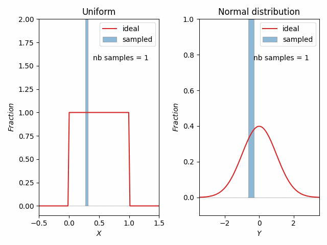

# Generating samples from a custom density function

# Introduction
In this repository, I tried to build – **from scratch** – a tool that enables sampling from a custom probability 
density function. Particularly, I implemented the [inverse transform sampling](https://en.wikipedia.org/wiki/Inverse_transform_sampling) 
which is a method used to generate samples from density function by leveraging a uniform distribution. 
It exploits both the bijection between a uniform and a custom density function, and the ease of sampling from a uniform distribution 
(through a [pseudorandom generator](https://en.wikipedia.org/wiki/Pseudorandom_number_generator)).

I have written a detailed article about the topic where I explain the intuition behind this method. Here is the [link]() for the article.


# About this repository
The developed tool that enables sampling from a custom density function comes in a form of a class `DistributionFunction`

The class needs two argument to be instantiated: 
- explicit formula of the density function 
- the interval on which it is defined

Within the class, I define the **cumulative distribution function** which will be used to implement the mapping process.

The main method of the class is `generate_samples`, which enables generating `n` samples from the given probability density function. 
This method call `n` time the method `map_dist_uniform` which map a randomly generated number to it peer in the density function.

Also, there is an implementation of a slightly modified version of binary search. It is used to help 
determining a suitable starting point to solve the mapping process equation.

These tools can be found in `tools` folder.

The remaining scripts are meant to create animation and graphs for the article.


# Create a custom density function
Here are code snippets that show how to use this tool.

Example of creating samples from custom density function
Note that `RecFunction` is a function that is equal to 1 in a given interval
and equal to zero otherwise

```python
# imports
import numpy as np
import matplotlib.pyplot as plt

from tools.class_distribution_function import DistributionFunction
from tools.step_functions import RecFunction
```


We first define the density function as well as the interval in which it is defined.
Then we create an instance of `DistributionFunction`

```python
interval = [0, 1]
f = lambda u: 3 * u ** 2 * RecFunction(*interval)(u)

dist = DistributionFunction(
    func=f,
    interval=interval
)
```


Plot of the density function
```python
nb_points = 100
y = np.linspace(*interval, nb_points)

plt.plot(y, dist(y))
```


Plot of the cumulative distribution function
```python
probs = [dist.cumulative_dist_function(y0) for y0 in y]

plt.plot(y, probs)
```


Generate samples
```python
size = 100

print(dist.generate_samples(size))
```


# Some beautiful animations
I made an animation to see the mapping algorithm in action


I also made an animation where I generate samples from a uniform and map them to their peers. 

The animation shows the evolution of the histogram bars length. 
As we increase the number of samples the bars approach the curve of the density function.




> Rendezvous: "Insight on pseudonumber generators"